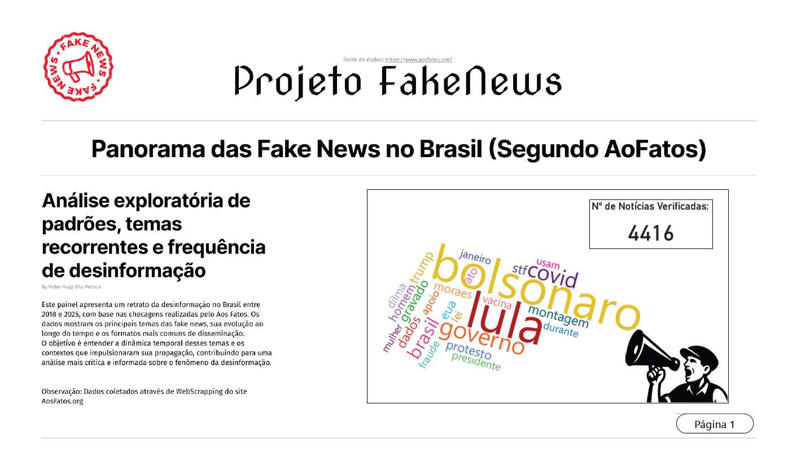
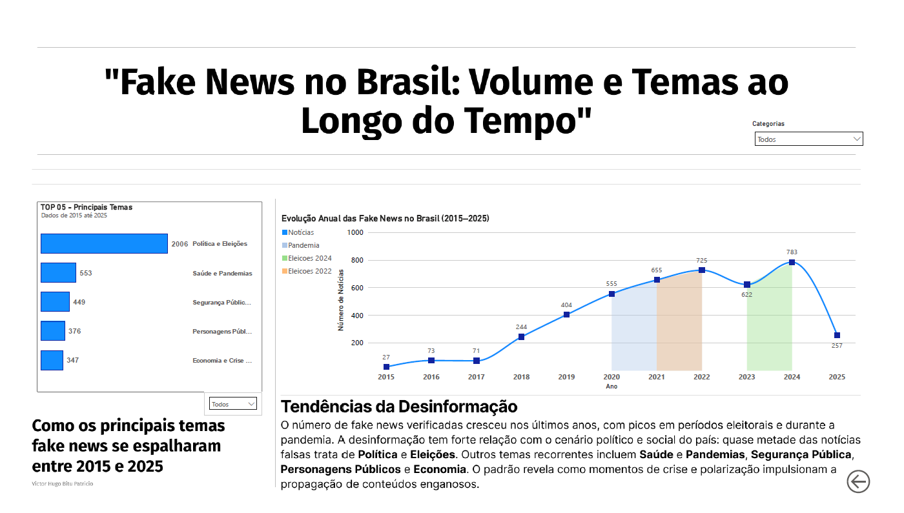

# Fake News ETL Project

Projeto para coleta, tratamento, classificação e análise de dados de notícias falsas, utilizando técnicas de web scraping, NLP e APIs do ChatGPT para classificação temática e de vereditos.

---

## Estrutura do Projeto

```
fake-news-etl-project/
├── data/
│   ├── external/
│   ├── interim/
│   ├── processed/
│   ├── public/
│   └── raw/
├── dashboard/
│   ├── dashboard_fake_news_v1.pbix
│   ├── dashboard_fake_news_pag1
│   └── dashboard_fake_news_pag2
├── docs/
├── models/
├── notebooks/
│   ├── exploratory/
│   └── experiments/
├── reports/
├── scripts/
├── src/
├── .gitignore
├── LICENSE
├── Makefile
├── README.md
├── requirements.txt
└── setup.py
```

---

## Principais Etapas do Projeto

1. **Coleta de dados:** scraping com Selenium e Playwright (`scripts/01_scraping_listagem_selenium.py`, `scripts/02_scraping_detalhes_playwright.py`)  
2. **Tratamento e integração:** limpeza e merge dos dados (`scripts/03_merge_scraping.py`)  
3. **Classificação:** classificação temática e de vereditos via API do ChatGPT (`scripts/07_classificacao_fake_news_chatgpt.py`, `scripts/09_classificacao_vereditos_chatgpt.py`)  
4. **Análise exploratória:** notebooks para visualização e análise dos dados (`notebooks/exploratory/`)  
5. **Dashboard:** painel interativo em Power BI (`dashboard/dashboard_fake_news_v1.pbix`)

---

## Como Executar

### 1. Configure a chave API da OpenAI como variável de ambiente

**Linux/macOS**

```bash
export OPENAI_API_KEY='sua-chave-aqui'
```

**Windows PowerShell**

```powershell
setx OPENAI_API_KEY "sua-chave-aqui"
```

### 2. Instale as dependências

```bash
pip install -r requirements.txt
```

### 3. Execute os scripts na ordem para coletar, tratar, classificar e analisar os dados

### 4. Explore os notebooks para análises detalhadas ou abra o dashboard no Power BI para visualização interativa

---

## Contato

Victor Hugo Bitu Patricio – [LinkedIn](https://www.linkedin.com/in/vhbitu/)

---

## .gitignore Sugerido

```
__pycache__/
*.py[cod]
.env

Ignora toda a pasta data, exceto a pasta data/public

/data/*
!/data/public/
dashboard/*.pbix
.vscode/
.DS_Store
```

---

## Requisitos Básicos (`requirements.txt`)

```
pandas>=1.3.0
numpy>=1.21.0
matplotlib>=3.4.0
seaborn>=0.11.0
openai>=0.27.0
playwright>=1.20.0
dateparser>=1.1.0
bertopic[visualization]>=0.14.0
umap-learn>=0.5.3
hdbscan>=0.8.29
sentence-transformers>=2.2.0
plotly>=5.10.0
```

---

## Makefile Simplificado

```makefile
.PHONY: all clean

all: coletar tratar classificar analisar

coletar:
	python scripts/01_scraping_listagem_selenium.py
	python scripts/02_scraping_detalhes_playwright.py
	python scripts/03_merge_scraping.py

tratar:
	python scripts/04_diagnostico_dados.py

classificar:
	python scripts/07_classificacao_fake_news_chatgpt.py
	python scripts/09_classificacao_vereditos_chatgpt.py

analisar:
	jupyter nbconvert --to notebook --execute notebooks/exploratory/08_analise_classificacao_chatgpt.ipynb
```

---

## 📊 Dashboard de Fake News

**Página 1 – Evolução das Fake News e Principais Temas:**



**Página 2 – Introdução e Nuvem de Palavras:**



Este dashboard mostra a evolução da desinformação no Brasil entre 2015 e 2025, com foco em eventos críticos como eleições e pandemia. Também destaca os principais temas recorrentes nas fake news analisadas.

---
